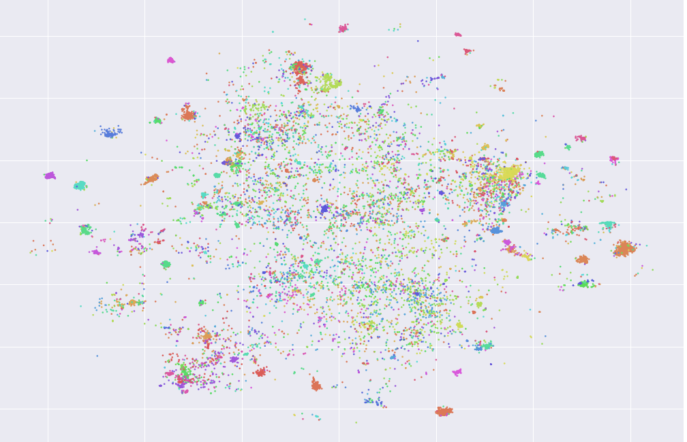

<h1 align="center" style="color: #916BBF;"><b>Yuno</b></h1>
    

https://user-images.githubusercontent.com/67608276/144100319-4cb02dd8-f39d-4cbb-98a3-72a3f5b79522.mp4

 

# Table of Contents
 1. [**Introduction**](#introduction)
 2. [**Try Yuno**](#try-yuno) 
 3. [**How Yuno was created?**](#Creation)

# Introduction

Yuno is a context based search engine that indexes over 0.5 million anime reviews and other anime informations. To help you find anime with specific properties. This search engine will help people of [r/AnimeSuggest](http://reddit.com/r/AnimeSuggest) who are looking for specific type of anime to watch.

This search engine was created to solve the problem of finding an object with specific properties and the object in this case is anime. But this search engine can be easily extended to any domain like books,movies,etc. Without the need of any kind of handcrafted dataset.

## **Try Yuno (Both notebooks has UI.)**
1. **[Kaggle Notebook](https://www.kaggle.com/iamparadox/yunoo)** (Recommended notebook)
2. **[Colab Notebook](https://colab.research.google.com/drive/1WAewYgHDmDEWhPBBOvGgyLTiOaasVyOz?usp=sharing)**

## **Creation**
All the details about how Yuno was created and everything related is in the following article.

Below are the few kaggle notebooks that you can look into to learn more about the creation of Yuno:

 1. [Anime Search Visualization](https://www.kaggle.com/iamparadox/anime-search-visualization)
    This notebook contains interactive visualization of all reviews plotted from 1280D -> 2D using [T-SNE](https://www.jmlr.org/papers/v9/vandermaaten08a.html).
    

2. [Yuno Models](https://www.kaggle.com/iamparadox/yuno-models)
    This notebook contains all the information about training Yuno with it's parameters.
