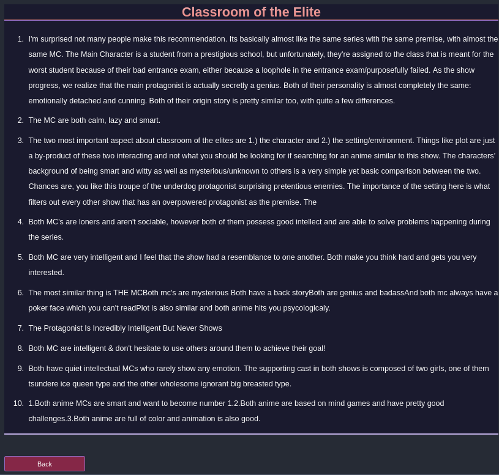

<h1 align="center" style="color: #916BBF;"><b>Yuno</b></h1>
    

 

 

# Table of Contents
 1. [**Introduction**](#introduction)
 2. [**Try Yuno**](#try-yuno) 
 3. [**Example**](#example)

# Introduction

Yuno is a context based search engine that indexes over 0.5 million anime reviews and other anime informations. To help you find anime with specific properties.

This search engine was created to solve the problem of finding an object with specific properties and the object in this case is anime. But this search engine can be easily extended to any domain like books,movies,etc. Without the need of any kind of handcrafted dataset.

This search engine will help people who are using subreddit's like:
  1. [r/Animesuggest](https://www.reddit.com/r/Animesuggest/)
  2. [r/Booksugesstions](https://www.reddit.com/r/Booksuggestions/)
  3. [r/MovieSuggestions](https://www.reddit.com/r/MovieSuggestions/)
  4. etc.

Uptil now usually if you want to watch a particular anime that has some specific property like
anime with **medieval theme and revenge plot**. You would have to ask different people about it
if anyone of them has watched such kind of anime then they will recommend it. Hence, subreddits
like [r/Animesuggest](https://www.reddit.com/r/Animesuggest/) were created. But that's very inefficient my hypothesis was **reviews contains enough information about that particular anime
that will statisfiy queries like mentioned above.** or framed differently **if a person looking for a specific type of anime if he/she will read all the reviews about a particular anime then
that will be sufficient for him/her to decide whether this anime has that specific properties or not.**

## **Try Yuno**
1. **[Kaggle Notebook](https://www.kaggle.com/iamparadox/yunoo)**
2. **[Colab Notebook](https://colab.research.google.com/drive/1WAewYgHDmDEWhPBBOvGgyLTiOaasVyOz?usp=sharing)**

## **Example**

  > **anime with smart and loner MC.**

  &nbsp;&nbsp;&nbsp;&nbsp;&nbsp; **Results:**

  &nbsp;&nbsp;&nbsp;&nbsp;&nbsp;   **My Teen Romantic Comedy SNAFU:**

 *  
   Both are told from male perspective .Both MCs are loners by choice .Both have many catchy phrases/ quotable dialogues.

   Both have some kind of philosophical/ psychological monologues .Both MCs are put in a situation where they have to go out of their ways and interact with others.
